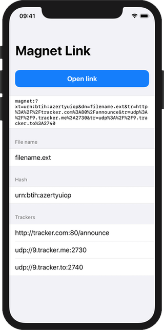
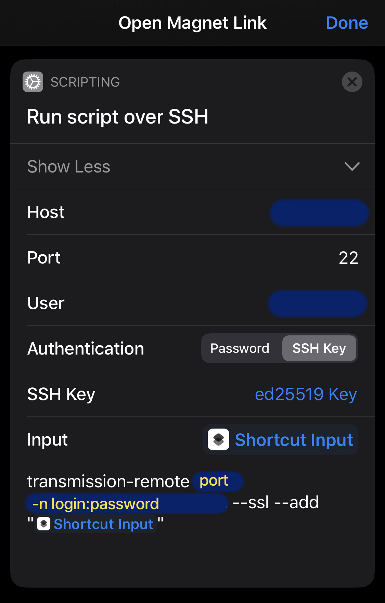

#  Magneto

This utility app registers the `magnet:` URL scheme, quickly parses the link and offers to launch a shortcut called **Open Magnet Link** with the magnet link as input.

## Motivation

iOS Safari does not make it easy to copy links using schemes it does not recognize. As such, copying `magnet:` links and pasting them was cumbersome if not sometimes impossible. This app was built as a way to handle those links. Typically, the shortcut I'm using connects to a server using SSH and sends the magnet link to a Transmission process using `transmission-remote`.

## Application interface

## Example iOS Shortcut

Configuration example for the Run Script over SSH action

---

The code is public domain.  
[Magneto Helmet by Joe Van Wetering](https://dribbble.com/shots/1856877-Magneto-Helmet)
